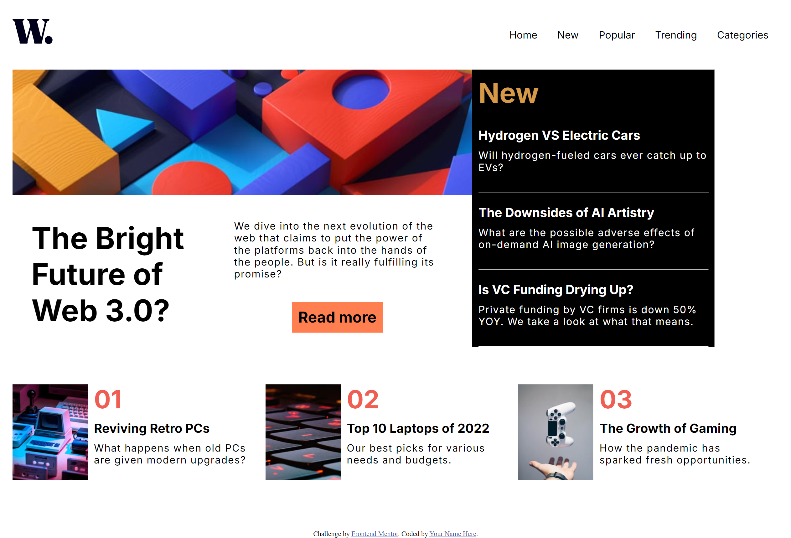

# Frontend Mentor - News homepage solution

This is a solution to the [News homepage challenge on Frontend Mentor](https://www.frontendmentor.io/challenges/news-homepage-H6SWTa1MFl). Frontend Mentor challenges help you improve your coding skills by building realistic projects. 

## Table of contents

- [Overview](#overview)
  - [The challenge](#the-challenge)
  - [Screenshot](#screenshot)
  - [Links](#links)
- [My process](#my-process)
  - [Built with](#built-with)
  - [What I learned](#what-i-learned)
  - [Continued development](#continued-development)
  - [Useful resources](#useful-resources)
- [Author](#author)
- [Acknowledgments](#acknowledgments)

## Overview

This challenge was to build out this news website homepage as similar to the design as possible.

### The challenge

Users should be able to:

- View the optimal layout for the interface depending on their device's screen size
- See hover and focus states for all interactive elements on the page

### Screenshot



### Links

- Solution URL: https://learningcoding2022.github.io/news-homepage/

## My process

I coded this project with a mobile first approach. In order to create the html, css, and javascript for the hamburger menu for mobile that disappears for desktop, I used outside resources that are provided in the useful resources section below. 

### Built with

- Semantic HTML5 markup
- CSS custom properties
- Sass
- Flexbox
- CSS Grid
- Mobile-first workflow
- JavaScript

### What I learned

This is the first project with a nav bar I coded that changes when it is in mobile mode as compared to desktop. It took research and problem solving to determine the code under the nav id of "navbar". I also learned how to develop a hamburger menu with an icon that changes from a hamburger icon to a close icon. Here is some code I am proud of:

```html
  <nav id="navbar" class="navbar">
    <ul>
      <li>
        
      </li>
      <div class="nav-toggle">
        <li>
          <a href="#">Home</a> 
        </li>
        <li>
          <a href="#">New</a> 
        </li>
        <li>
          <a href="#">Popular</a> 
        </li>
        <li>
          <a href="#">Trending</a> 
        </li>
        <li>
          <a href="#">Categories</a> 
        </li>
      </div>
    </ul>
    <button id="hamburger-toggle" class="hamburger">
      <div class="icon-open">
        
      </div>
      <div class="icon-close">
        
      </div>
    </button>
  </nav>
```

```css
@media screen and (max-width: 650px) {
  .navbar.open ul {
    display: block;
  }
  .navbar.open .nav-toggle {
    display: block;
  }
  .navbar.open a {
    display: block;
  }
  .navbar .nav-toggle {
    display: none;
  }
  .navbar .hamburger {
    display: block;
  }
  .navbar.open .hamburger .icon-open {
    display: none;
  }
  .navbar.open .hamburger .icon-close {
    display: block;
  }
}
.text-box {
  padding: 20px 0;
  border-bottom: solid white 1px;
}
```

```js
function onHamburgerClick() {
    if (!navbar.classList.contains("open")) {
        navbar.classList.add("open");
    } else {
        navbar.classList.remove("open");
    }
}
```

### Continued development

I would like to continue to learn various approaches to making nav bars responsive as well as other creating other features that are responsive to the screen size. I'd also like to create additional projects that use the same hamburger menu so I can become more comfortable with this code and better understand the html, css, and javascript. 

### Useful resources

- [screenshot resource](https://www.google.com/search?q=what+is+the+best+way+to+get+a+screenshot+of+my+webpage+for+a+readme+file&oq=what+is+the+best+way+to+get+a+screenshot+of+my+webpage+for+a+readme+file&gs_lcrp=EgZjaHJvbWUyBggAEEUYOdIBCTE4OTU3ajBqN6gCALACAA&sourceid=chrome&ie=UTF-8#fpstate=ive&vld=cid:db6142bc,vid:f6U1ak8TRj0,st:23) 
- This helped me take a screenshot on my webpage and use this within the readme document (click inspect, click performance, and type in screenshot)

- [hamburger menu resources]
(https://www.youtube.com/watch?v=U8smiWQ8Seg) 
(https://www.youtube.com/watch?v=VQWu4e6agPc)
- These videos helped me better understand how to create a responsive navbar.

## Author

- Website - [Add your name here](https://learningcoding2022.github.io/Portfolio-page/)

## Acknowledgments

I worked alongside Vanesa Garcia for this project. Working alongside someone provided accountability in completing tasks in certain time frames as well as encouragement. We both built our own code, but problem solved together when I encountered a few road blocks. Thanks Vanesa! 

